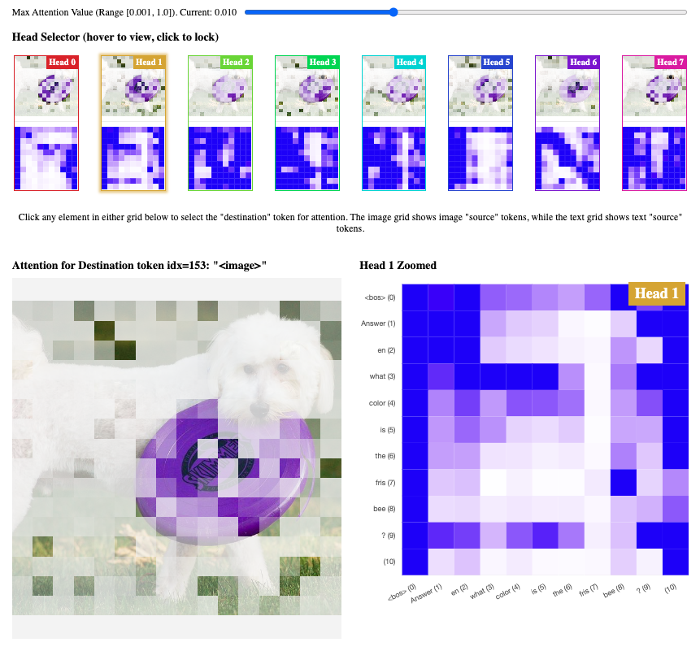

# Drilling Down into Multimodal Attention



This is the code for the post [Drilling Down into Multimodal Attention](https://tomasruizt.github.io/posts/multimodal-attn/). All figures can be reproduced by running the `PaliGemma2_getAttention.ipynb` notebook.

## Setup

The setup needs a local version of `circuitsvis` to be installed, and `yarn` to be installed.

To install local `circuitsvis`, run the `install_circuitsvis.sh` script.

To install yarn:

```bash
# install yarn: needs npm, needs nvm
# from: https://nodejs.org/en/download
curl -o- https://raw.githubusercontent.com/nvm-sh/nvm/v0.40.1/install.sh | bash
nvm install 22
corepack enable yarn
cd ./CircuitsVis/react && yarn install
```
